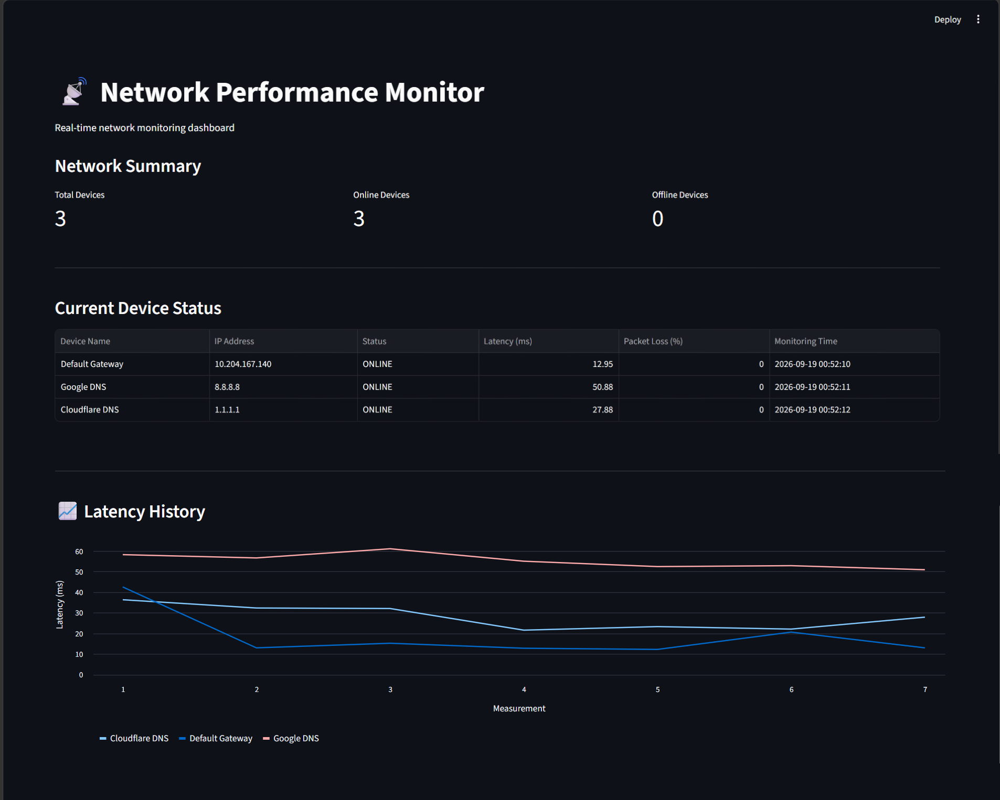

# 📡 Network Performance Monitor

<p align="center">
  
  
  
  
</p>

<p align="center">
  A Python and MySQL-based network performance monitoring system that measures
  network latency and packet loss, stores monitoring results, generates reports
  and graphs, and provides an interactive Streamlit dashboard.
</p>

---

## 📖 About the Project

The **Network Performance Monitor** is designed to monitor and analyze network
performance using Python.

The system collects network statistics such as **latency** and **packet loss**
and stores monitoring results in a **MySQL database**.

The collected information can then be used to generate reports, create graphs,
and visualize historical network performance through an interactive
**Streamlit dashboard**.

This project demonstrates the integration of:

- Python programming
- Network monitoring
- MySQL database management
- Data visualization
- Automated monitoring
- Report generation
- Interactive dashboards

---

## ✨ Features

| Feature | Description |
|---|---|
| 📡 **Network Monitoring** | Monitors network connectivity and performance |
| ⚡ **Latency Measurement** | Measures network response time |
| 📉 **Packet Loss Monitoring** | Detects packet loss during network tests |
| 🗄️ **MySQL Database** | Stores monitoring results for historical analysis |
| 🔄 **Automatic Monitoring** | Supports automated network monitoring |
| 📊 **Graph Generation** | Generates visual representations of network data |
| 📄 **Report Generation** | Creates reports from collected monitoring information |
| 🖥️ **Streamlit Dashboard** | Displays network statistics through an interactive dashboard |
| 🕒 **Historical Monitoring** | Allows previously collected performance data to be analyzed |
| 🔐 **Environment Variables** | Protects database credentials from being hard-coded |

---

## 🛠️ Technology Stack

| Technology | Purpose |
|---|---|
| 🐍 **Python** | Core application and network monitoring |
| 🐬 **MySQL** | Storage of network monitoring information |
| 📊 **Streamlit** | Interactive web dashboard |
| 🐼 **Pandas** | Data processing and analysis |
| 📈 **Matplotlib** | Graph and data visualization |
| 🔐 **python-dotenv** | Environment variable management |
| 🔧 **Git** | Version control |
| 🐙 **GitHub** | Source-code hosting |

---

## 🏗️ System Architecture

```text
                   ┌──────────────────────┐
                   │    Network Target    │
                   │   Host / IP Address  │
                   └──────────┬───────────┘
                              │
                              ▼
                   ┌──────────────────────┐
                   │   Network Monitor    │
                   │       Python         │
                   └──────────┬───────────┘
                              │
                    Collects Performance
                         Information
                              │
                              ▼
                   ┌──────────────────────┐
                   │    MySQL Database    │
                   │   Monitoring Data    │
                   └──────────┬───────────┘
                              │
                 ┌────────────┼────────────┐
                 │            │            │
                 ▼            ▼            ▼
        ┌──────────────┐ ┌──────────┐ ┌──────────────┐
        │    Graphs    │ │ Reports  │ │  Streamlit   │
        │              │ │          │ │  Dashboard   │
        └──────────────┘ └──────────┘ └──────────────┘
```

---

## 📁 Project Structure

```text
NetworkPerformanceMonitor/
│
├── src/
│   ├── network_monitor.py
│   ├── auto_monitor.py
│   ├── db_connection.py
│   ├── dashboard.py
│   ├── generate_graph.py
│   └── generate_report.py
│
├── database/
│
├── reports/
│
├── .gitignore
├── README.md
└── requirements.txt
```

---

## 🧩 Project Components

### 📡 `network_monitor.py`

Responsible for the main network monitoring functionality.

It performs network tests and collects performance information such as
latency and packet loss.

---

### 🔄 `auto_monitor.py`

Provides automated monitoring functionality.

It allows network performance measurements to be collected automatically
rather than requiring every test to be started manually.

---

### 🗄️ `db_connection.py`

Handles communication between the Python application and the MySQL database.

Keeping database connection logic in a separate module makes the project
easier to maintain and organize.

---

### 🖥️ `dashboard.py`

Contains the Streamlit dashboard.

The dashboard provides a user-friendly interface for viewing network
monitoring information and historical performance data.

---

### 📈 `generate_graph.py`

Generates graphical visualizations from the collected network performance
data.

Graphs make it easier to identify changes and trends in network performance.

---

### 📄 `generate_report.py`

Generates reports using the network monitoring information stored by the
application.

---

## 🔄 Application Workflow

```text
Start Application
       │
       ▼
Select / Define Network Target
       │
       ▼
Perform Network Test
       │
       ├──────────────► Measure Latency
       │
       └──────────────► Measure Packet Loss
       │
       ▼
Store Monitoring Result
       │
       ▼
    MySQL Database
       │
       ├──────────────► Generate Reports
       │
       ├──────────────► Generate Graphs
       │
       └──────────────► Streamlit Dashboard
```

---

## 🗄️ Database

The application uses **MySQL** to store network monitoring results.

Typical monitoring information includes:

| Data | Description |
|---|---|
| 🌐 Target | Network host or IP address being monitored |
| ⚡ Latency | Network response time |
| 📉 Packet Loss | Percentage of packets that were lost |
| 🕒 Timestamp | Date and time when monitoring was performed |

Storing the results in a database allows the application to analyze
network performance over time.

---

## 📊 Dashboard

The project includes a **Streamlit dashboard** for visualizing network
performance information.

The dashboard can be used to display information such as:

- Network targets / IP addresses
- Latency
- Packet loss
- Monitoring timestamps
- Historical monitoring information
- Latency history visualization

---

## 📸 Dashboard Preview

<p align="center">
  
</p>

---

## ⚙️ Installation

### 1️⃣ Clone the Repository

```bash
git clone https://github.com/vithyashini1211/Network-Performance-Monitor.git
```

Move into the project directory:

```bash
cd Network-Performance-Monitor
```

---

### 2️⃣ Create a Virtual Environment

```bash
python -m venv venv
```

---

### 3️⃣ Activate the Virtual Environment

#### Windows PowerShell

```powershell
.\venv\Scripts\Activate.ps1
```

If PowerShell prevents the activation script from running, you can temporarily
allow it for the current PowerShell session:

```powershell
Set-ExecutionPolicy -Scope Process -ExecutionPolicy RemoteSigned
```

Then activate the environment again:

```powershell
.\venv\Scripts\Activate.ps1
```

---

### 4️⃣ Install Dependencies

```bash
pip install -r requirements.txt
```

---

## 🔐 Environment Configuration

Database credentials should **not** be written directly inside the Python
source files.

Create a file named:

```text
.env
```

in the project root.

Example configuration:

```env
DB_HOST=localhost
DB_USER=your_mysql_username
DB_PASSWORD=your_mysql_password
DB_NAME=your_database_name
```

Replace the example values with your own MySQL configuration.

---

## 🚀 Running the Application

Make sure the virtual environment is activated before running the project.

### 📡 Run Network Monitoring

```bash
python src/network_monitor.py
```

### 🔄 Run Automatic Monitoring

```bash
python src/auto_monitor.py
```

### 📈 Generate Graphs

```bash
python src/generate_graph.py
```

### 📄 Generate Reports

```bash
python src/generate_report.py
```

### 🖥️ Launch the Streamlit Dashboard

```bash
streamlit run src/dashboard.py
```

After starting Streamlit, open the local address displayed in the terminal
to access the dashboard.

---

## 🔒 Security

The project follows basic security practices by keeping sensitive database
credentials outside the Python source code.

The `.gitignore` file should exclude files and folders such as:

```text
.env
venv/
__pycache__/
*.pyc
```

This prevents local configuration files, credentials, virtual environments,
and generated Python cache files from being accidentally committed to GitHub.

---

## 💡 Example Use Cases

This project can be useful for:

- Monitoring local network performance
- Detecting latency changes
- Identifying packet loss
- Recording network performance over time
- Comparing historical network measurements
- Learning Python networking concepts
- Learning Python and MySQL integration
- Practicing database-driven application development
- Building monitoring dashboards
- Learning data visualization with Python

---

## 🔮 Future Improvements

Possible future enhancements include:

- 🔔 Real-time network failure alerts
- 📧 Email notifications
- 🌐 Multiple-host monitoring
- ⏱️ Configurable monitoring intervals
- 📊 Advanced dashboard analytics
- 📥 CSV report export
- 📄 PDF report export
- 📱 Responsive dashboard improvements
- 🔎 Network availability statistics
- 📈 Additional historical performance charts
- 🚨 Automatic detection of abnormal latency
- 🔐 User authentication for the dashboard

---

## 📌 GitHub Workflow

After making changes to the project, they can be uploaded using:

```bash
git add .
git commit -m "Update project"
git push
```

For example:

```bash
git add .
git commit -m "Improve network monitoring dashboard"
git push
```

---

## 👩‍💻 Author

**Vithyashini Thiruchelvam**

Network Performance Monitor developed using **Python, MySQL, and Streamlit**.

---
<p align="center">
  <b>📡 Monitor • 📊 Analyze • 📈 Visualize</b>
</p>
